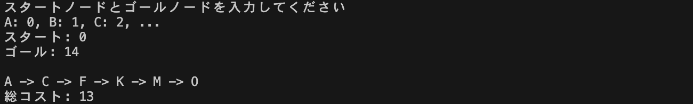

# コンピュータネットワーク　レポート
* 学籍番号：2264088
* 氏名：河原畑 宏次
* 所属：情報工学EP

<br>

## 課題1　ダイクストラ法に基づいて最短経路問題を解くプログラムの作成
### ソースファイル
 
ソースファイル : `example_NodePath.txt`

``` txt
9 6 
0 1 1
0 2 4
1 2 2
1 3 4
1 4 3
2 3 2
3 4 2
3 5 4
4 5 1
```


ソースファイル : `Dijkstra.c`


``` C
#include <limits.h>
#include <stdio.h>
#include <stdlib.h>


// ダイクストラ砲で計算した結果を保存する構造体
typedef struct {
    int node;       // ノード番号
    int cost;       // コスト
    int parent;     // 親ノード番号
    int isFixed;    // 確定したノードなら1。そうでないなら0
} NODEINFO;


/* プロトタイプ宣言 */
// コストテーブルを作成する関数
void makeCostTable(int nodeNum, int costTable[nodeNum][nodeNum], int pathNum, FILE *fp);

// リザルトテーブルを作成する関数
void makeResultTable(int nodeNum, NODEINFO resultTable[nodeNum], int startNode);

// ダイクストラ法を実行する関数
void exeDijkstra(int nodeNum, int costTable[nodeNum][nodeNum], int startNode, int endNode, NODEINFO resultTable[nodeNum]);

// 結果（最短経路）を表示する関数
void printResult(NODEINFO resultTable[], int startNode, int dstNode);

// リザルトテーブルを表示する関数（デバッグ用）
void printResultTable(int nodeNum, NODEINFO resultTable[nodeNum]);
// ----- プロトタイプ宣言ここまで -----


int main(void) {
    // ファイルの読み込み
    char fileName[] = "example_NodePath.txt";  // ファイル名
    FILE *fp = NULL;                           // ファイルポインタ
    if ((fp = fopen(fileName, "r")) == NULL) {
        printf("%s : ファイルを開けませんでした\n", fileName);
        exit(-1);
    }


    // パスの数とノードの数を入力
    int pathNum = -1;  // パスの数
    int nodeNum = -1;  // ノードの数
    fscanf(fp, "%d %d", &pathNum, &nodeNum);


    // スタートノードとゴールノードを入力
    int startNode = -1;  // スタートノード
    int endNode = -1;    // ゴールノード
    do {
        printf("スタートノードとゴールノードを入力してください\n");
        printf("A: 0, B: 1, C: 2, ...\n");
        printf("スタート: ");
        scanf("%d", &startNode);
        printf("ゴール: ");
        scanf("%d", &endNode);
        printf("\n");
    } while (startNode < 0 || startNode >= nodeNum || endNode < 0 || endNode >= nodeNum);

    // コストテーブル（経路表）を作成
    int costTable[nodeNum][nodeNum];  // コストテーブル（経路表）
    makeCostTable(nodeNum, costTable, pathNum, fp);


    // ダイクストラ法の結果を保存するリザルトテーブルを作成
    NODEINFO resultTable[nodeNum];
    makeResultTable(nodeNum, resultTable, startNode);


    // ダイクストラ法を実行しリザルトテーブルを作成
    exeDijkstra(nodeNum, costTable, startNode, endNode, resultTable);


    // リザルトテーブルの表示（デバッグ）
    // printResultTable(nodeNum, resultTable);


    // 結果（最短経路と総コスト）の表示
    printResult(resultTable, startNode, endNode);
    printf("\n総コスト: %d\n", resultTable[endNode].cost);

    return 0;
}


// コストテーブル（経路表）を作成する関数
void makeCostTable(int nodeNum, int costTable[nodeNum][nodeNum], int pathNum, FILE *fp) {
    // コストテーブルの初期化
    for (int i = 0; i < nodeNum; i++)
        for (int j = 0; j < nodeNum; j++) costTable[i][j] = -1;

    // コストテーブル（経路表）の作成
    for (int i = 0; i < pathNum; i++) {
        // 1行（出発点 到着点 かかるコスト）ごと読み取り
        int srcNode = -1, dstNode = -1, cost = -1;
        fscanf(fp, "%d %d %d", &srcNode, &dstNode, &cost);

        // 表にコストを記入。出発点と到着点が逆の場合も記入する
        costTable[srcNode][dstNode] = cost;
        costTable[dstNode][srcNode] = cost;
    }
}


// リザルトテーブルを作成する関数
void makeResultTable(int nodeNum, NODEINFO resultTable[nodeNum], int startNode) {
    for (int i = 0; i < nodeNum; i++) {
        resultTable[i].node = i;
        resultTable[i].cost = INT_MAX;  // 最初のコストは無限大
        resultTable[i].isFixed = 0;

        if (i == startNode) {                   // スタートノードの場合
            resultTable[i].parent = startNode;  // 親は自分自身
            resultTable[i].cost = 0;            // スタートノードのコストは0
            resultTable[i].isFixed = 1;         // スタートノードは確定
        } else {
            resultTable[i].parent = -1;
        }
    }
}


// ダイクストラ法を実行する関数
void exeDijkstra(int nodeNum, int costTable[nodeNum][nodeNum], int startNode, int endNode, NODEINFO resultTable[nodeNum]) {
    int srcNode = startNode;    // 出発ノード
    do {
        int minimumCostNode = -1;   // 確定していない中で最小のコストのノード
        int minimumCost = INT_MAX;  // 最小のコスト
        
        for (int i = 0; i < nodeNum; i++) {
            // ノードiまでのコスト = ノードsrcからノードiまでのコスト + スタートノードからノードsrcまでのコスト
            int costToNode_i = costTable[srcNode][i] + resultTable[srcNode].cost;

            // コストテーブルのコストが０より大きく（経路がある）、現在のリザルトコストより小さい場合はコストを更新
            if (costTable[srcNode][i] > 0 && costToNode_i < resultTable[i].cost) {
                resultTable[i].cost = costToNode_i;
                resultTable[i].parent = srcNode;
            }
            
            // 確定していないノードの中でコストが最小のノードを検索
            if (!resultTable[i].isFixed && resultTable[i].cost < minimumCost) {
                minimumCost = resultTable[i].cost;
                minimumCostNode = i;
            }
        }

        // 確定していないノードの中でコストが最小のノードを確定させて次の出発ノードに選択
        resultTable[minimumCostNode].isFixed = 1;
        srcNode = minimumCostNode;

    } while (!resultTable[endNode].isFixed);  // ゴールノードが確定すると終了
}


// 結果（最短経路）を表示する関数
void printResult(NODEINFO resultTable[], int startNode, int dstNode) {
    // 親ノードがスタートノードと一致しない場合
    if(resultTable[dstNode].parent != startNode) {
        printResult(resultTable, startNode, resultTable[dstNode].parent);
    } 
    // 親ノードがスタートノードである場合はそのノードはスタートノードなのでノード名を出力（再帰処理の終了）
    else {
        printf("%c", 'A' + startNode);
    }
    // 現在のノードから次に訪れるノードを出力
    printf(" -> %c", 'A' + resultTable[dstNode].node);
}


// ダイクストラ法を実行した後のリザルトテーブルを表示する関数（デバッグ用）
void printResultTable(int nodeNum, NODEINFO resultTable[nodeNum]) {
    // リザルトテーブルを表示
    printf("ノード | コスト | 親ノード\n");
    for (int i = 0; i < nodeNum; i++) {
        printf("   %c   |   %2d   |    %c    \n", 'A' + resultTable[i].node,
               resultTable[i].cost, 'A' + resultTable[i].parent);
    }
}
```

<br>

<div style="page-break-before:always"></div>


### プログラムの説明
#### プログラムの概要
ダイクストラ法に基づいて最短経路問題を解くプログラムを作成した。ただし、グラフが次のように与えられた際、そのグラフをもとに次のようなパラメータを持つデータ形式（txtファイル）でグラフを表現する。


プログラムは主に次の手順で処理を行う。
1. 経路データのテキストファイルの読み込み
2. スタートノードとゴールノードのユーザーによる入力受付
3. コストテーブル（経路とそのコストを保存する表）の作成
4. リザルトテーブル（ダイクストラ法の結果を保存する表）の作成
5. ダイクストラ法の実行
6. 結果（最短経路と総コスト）の表示

ここでは、上記の手順3, 4, 5, 6について説明を行う。また説明において、手順1, 2において取得した次のパラメータを用いる。
| パラメータ|説明 | 
|:--:|--|
| `pathNum`|経路の数 | 
| `nodeNum`|ノードの数 | 
| `startNNode`|スタートノード | 
| `endNNode`|ゴールノード | 

<br>

#### コストテーブルについて
コストテーブルは経路とそのコストをデータファイルから読み込み保存する表のことである。具体的には次の図中の表を二次元配列`int costTable[nodeNum][nodeNum]`で表現する。ただし、表の中で経路が存在しない要素については初期値`-1`を与えた。また、この表の作成は関数`makeCostTable()`が行う。


<br>

#### リザルトテーブルについて
リザルトテーブルは、ダイクストラ法を実行した結果を保存する表のことである。具体的には次の図中の表を構造体配列で表現する。このリザルトテーブルの作成には、関数`makeResultTable()`で行うが、スタートノードについては初期値として、親を自分自身のノード番号、コストを0、確定フラグを1に設定する。下記の表は、スタートノードをA（0）、ゴールノードをF（5）に設定した際にダイクストラ法を実施した場合の途中結果を示す。ただしプログラムにおいて、コストの∞は定数`INT_MAX`で、親ノードの未定は`-1`で表現した。


```C
// ダイクストラ砲で計算した結果を保存する構造体
typedef struct {
    int node;       // ノード番号
    int cost;       // コスト
    int parent;     // 親ノード番号
    int isFixed;    // 確定したノードなら1。そうでないなら0
} NODEINFO;

NODEINFO resultTable[nodeNum];
```

<br>

#### ダイクストラ法の実行について
用意したコストテーブルやリザルトテーブルを用いてダイクストラ法を実際に行う処理は、関数`exeDijkstra()`に記述した。この関数では次のようなアルゴリズムに基づいてダイクストラ法を実行する。

1. スタートノードを出発ノードとして設定する
2. リザルトテーブルを用いて、スタートノードから出発ノードまでのコストを求める
3. コストテーブルを用いて、出発ノードから各ノードまでのコストを求める
4. 2, 3で読み取ったコストの和（スタートノードから出発ノードを通り次のノードに行くまでにかかるコスト）を求める
5. 4で得たコストとがリザルトテーブルのコストより小さければリザルトテーブルのコストを更新する
6. リザルトテーブルの確定していないノードの中でコストが最小のノードを確定させて次の出発ノードに選択する
7. 1 ~ 6をゴールノードが確定するまで繰り返す

ここで、２のスタートノードから出発ノードまでのコストに関しては、リザルトテーブルを用いて簡単に計算できる。なぜなら、出発ノードは必ず確定ノードであるため、リザルトテーブルのコストの欄に、スタートノードからの最小コストが記載されているからである。また、５の処理については、コストテーブルのコストが-1（経路が存在しない）の場合は計算を行わないようにしている。

<br>


#### 最短経路の表示について
ダイクストラ法を実行した後に、求めた最短経路を表示する処理は、関数`printResult()`に記述した。経路はスタートノードからゴールノードまでの経路を表示したい。しかし、リザルトテーブルからはゴールノードからスタートノードの順（逆順）に経路が判明する。そこで、再起処理を用いて次のようなアルゴリズムを組むことで、スタートノードからゴールノードの順に最短経路を表示した。

1. 到着ノード（最初の呼び出しではゴールノード）の親ノードがスタートノードと一致するかどうかを確認
2. 一致しない場合、関数は自身を再帰的に呼び出し、到着ノードの親ノードを新たな到着ノードとしてパスをたどる
3. 親ノードが到着ノードと一致する場合、つまり現在のノードがスタートノードである場合、そのノードを表示する
4. 最後に、現在のノードから次に訪れるノードの名前を表示する


<br>

### 実行結果
#### `example_NodePath.txt`を用いて、プログラムを実行した結果


* スタートノード: 0（A）, ゴールノード: 5（F）とした場合

* スタートノード: 5（F）, ゴールノード: 2（C）とした場合   


<br>

#### `my_NodePath_1.txt`を用いて、プログラムを実行した結果

`my_NodePath_1.txt`
``` txt
17 15
0 1 5
0 2 3
1 3 2
1 4 6
2 5 4
2 6 9
3 7 1
4 8 3
5 9 7
6 10 2
7 11 4
8 12 6
9 13 8
10 14 5
11 14 3
12 14 2
13 14 4
```


* スタートノード: 0（A）, ゴールノード: 14（O）とした場合


<br>

#### `my_NodePath_2.txt`を用いて、プログラムを実行した結果

`my_NodePath_2.txt`
``` txt
20 15
0 1 5
0 2 3
1 3 2
1 4 6
2 5 4
2 6 9
3 7 1
4 8 3
5 9 7
5 10 2
6 10 2
7 11 4
7 12 4
8 12 6
9 13 8
10 12 2
10 14 5
11 14 3
12 14 2
13 14 4
```


* スタートノード: 0（A）, ゴールノード: 14（O）とした場合


<br>

### 考察


<br>

---
